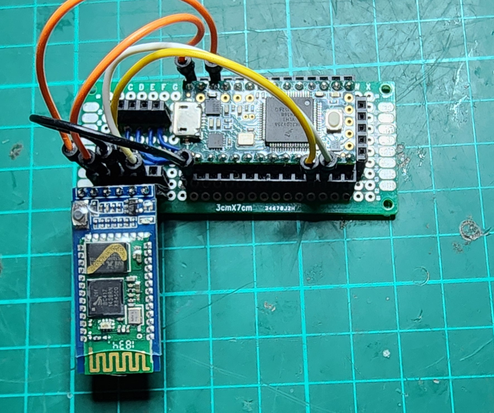

# HC-05 Programmer

This is a really simple serial proxy using a teensy 3.2 to issue AT commands.

This is only really useful when you want to change the `name` or the `pin` of the device but you are able to work with quite a few special parameters on the HC-05 boards.

the [HC-05_ATCommandSet.pdf](HC-05_ATCommandSet.pdf) file has all the AT commands.

## Wiring

The wiring is quite simple! I've connected:

| teensy | hc-05 |
| - | - |
| vin | 5v |
| gnd | gnd |
| tx2 | rx2 |
| rx2 | tx2 |
| 3.3v | en |



## The programming

The particular module shown above has a handy "en" button, so I had to hold this in while powering it up. This makes the LED on the HC-05 flash slowly meaning it's in "command mode" (then release the button).

So I held that button in while I plugged it into my computer and opened up the serial port monitor in PIO.

At that point type `AT` and, all going well, you'll get an `OK` back. Then you can proceed to play with the AT commands mentioned in the PDF above.

I pretty much use this soley to rename it. In which case it looks like this:

(my commands in parenthesis)

```txt
Reconnecting to COM7     Connected!
Enter AT commands:
(AT)
OK
(AT+NAME?)
HC-05
(AT+NAME=mycool_hc05)
OK
(AT+NAME?)
+NAME:mycool_hc05
```

Done, Fin, Viola, etc

References:

- [teensy 3.2](https://www.pjrc.com/store/teensy32.html)
- [a great instructible about this](https://www.instructables.com/AT-command-mode-of-HC-05-Bluetooth-module/)

## License

I like beer, so buy me a beer if you want and I'm not responsible for how you use this code.

```text
/* 
 * — — — — — — — — — — — — — — — — — — — — — — — — — — — — — — — — — 
 * “THE BEER-WARE LICENSE” (Revision 42):
 * <Spidey> wrote this file. As long as you retain this  
 * notice you can do whatever you want with this stuff. If we meet
 * some day, and you think this stuff is worth it, you can buy me
 * a beer in return.
 * — — — — — — — — — — — — — — — — — — — — — — — — — — — — — — — — — 
 * Amendment 1: The author(s) of this code accept absolutely no 
 * liability for any damage or general bad things that may come as 
 * part of its use. Any use of this software is deemed an agreement 
 * to absolve the author(s) of any liability, culpability, 
 * durability and any other “(*)ability” (good or bad).
 */
```
